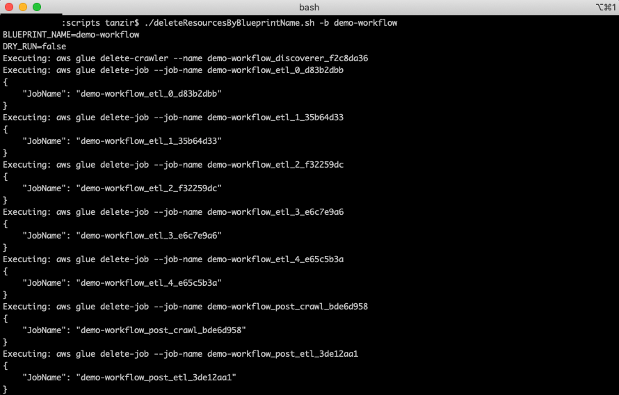

# AWS Glue & AWS Lake Formation Utility Scripts

A few AWS Glue & Lake Formation scripts that you might find useful and can save your development time. 

## Delete all Glue resources associated with a Lake Formation Blueprint

When you create a Blueprint through AWS Lake Formation, it creates a set of Glue resources - Glue Crawler, few
 Spark & Python shell jobs under Glue ETL, few Glue Triggers, and a Glue workflow. However, when you delete that
 Blueprint (as of 10/2020 ), corresponding Glue resources don't get deleted automatically. Also, through Glue console, you cannot delete
 multiple Glue jobs together, you need to delete them individually. So, the clean-up process can take time.
  
The following script deletes all Blueprint related Glue resources based on the Blueprint name. Before proceeding, make
 sure
 you configure AWS CLI for the account where you want to clean up your Glue resources.
 
[deleteResourceByBlueprintName.sh](scripts/deleteResourcesByBlueprintName.sh) 

It takes three parameters:
 
 - -d: [Optional parameter] It dry-runs the command without executing it
 - -b: Name of the blueprint
 
Example: 

With dry-run flag turned on:
```shell script
./deleteResourcesByBlueprintName.sh -b test-workflow -d
```

Without dry-run flag:
```shell script
./deleteResourcesByBlueprintName.sh -b test-workflow
```


